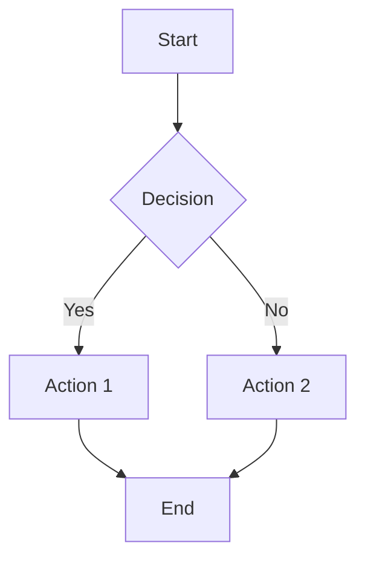

# DANH MỤC LOGIC FLOWS

**Dự án:** S-MIS - Student Management Information System  
**Ngày tạo:** 27/10/2025

---

## 📂 CẤU TRÚC THƯ MỤC

```
LOGIC_FLOWS/
├── README.md (file này)
├── 00_AUTHENTICATION_FLOW.md
├── 04_LOP_HOC_PHAN_FLOW.md
├── 05_DANG_KY_MON_HOC_FLOW.md
├── 07_NHAP_DIEM_FLOW.md
└── ... (các file khác)
```

---

## 📋 DANH SÁCH LOGIC FLOWS

### ✅ Đã hoàn thành:

| File                         | Tên chức năng          | Phase   | Actor      | Trạng thái code |
| ---------------------------- | ---------------------- | ------- | ---------- | --------------- |
| `00_AUTHENTICATION_FLOW.md`  | Đăng nhập & Phân quyền | Phase 0 | All        | ✅ Hoàn thành   |
| `04_LOP_HOC_PHAN_FLOW.md`    | Quản lý Lớp học phần   | Phase 4 | Đào tạo    | ⏳ Chưa làm     |
| `05_DANG_KY_MON_HOC_FLOW.md` | Đăng ký môn học        | Phase 5 | Sinh viên  | ⏳ Chưa làm     |
| `07_NHAP_DIEM_FLOW.md`       | Nhập điểm & Tính điểm  | Phase 7 | Giảng viên | ⏳ Chưa làm     |

---

## 🎯 MỤC ĐÍCH

Các file Logic Flow này được tạo ra để:

1. **Hướng dẫn Developer** cách implement các chức năng
2. **Giải thích luồng xử lý** từ đầu đến cuối
3. **Validate logic nghiệp vụ** trước khi code
4. **Tài liệu tham khảo** khi maintain code
5. **Testing scenarios** để viết test cases

---

## 📖 CÁCH ĐỌC

Mỗi file Logic Flow bao gồm:

### 1. **Flowchart dạng text**

```
[Bước 1]
    ↓
[Bước 2]
    ↓
[Decision]
↓       ↓
...     ...
```

### 2. **Chi tiết code implement**

```php
public function tenHam() {
    // Implementation
}
```

### 3. **Các bảng liên quan**

-   Liệt kê các bảng database được sử dụng
-   Foreign keys cần thiết
-   Indexes quan trọng

### 4. **Validation & Security**

-   Các điều kiện kiểm tra
-   Xử lý lỗi
-   Bảo mật

---

## 🔗 QUAN HỆ GIỮA CÁC FLOWS

```
00_AUTHENTICATION_FLOW
        ↓
    (Đăng nhập thành công)
        ↓
01_QUAN_LY_DANH_MUC (Phase 1)
        ↓
02_QUAN_LY_NHAN_SU (Phase 2, 3)
        ↓
04_LOP_HOC_PHAN_FLOW (Phase 4)
        ↓
05_DANG_KY_MON_HOC_FLOW (Phase 5)
        ↓
06_DIEM_DANH_FLOW (Phase 6)
        ↓
07_NHAP_DIEM_FLOW (Phase 7)
        ↓
08_HOC_PHI_FLOW (Phase 8)
```

---

## 📚 CÁC FLOW CẦN BỔ SUNG

### Phase 1: Danh mục & Cấu trúc

-   [ ] `01_QUAN_LY_KHOA_NGANH_FLOW.md`
-   [ ] `01_QUAN_LY_MON_HOC_FLOW.md`
-   [ ] `01_CHUONG_TRINH_KHUNG_FLOW.md`

### Phase 2: Nhân sự & Thời gian

-   [ ] `02_QUAN_LY_GIANG_VIEN_FLOW.md`
-   [ ] `02_QUAN_LY_HOC_KY_FLOW.md`

### Phase 3: Lớp học & Sinh viên

-   [ ] `03_QUAN_LY_LOP_HANH_CHINH_FLOW.md`
-   [ ] `03_QUAN_LY_SINH_VIEN_FLOW.md`

### Phase 6: Điểm danh & Dạy học

-   [ ] `06_DIEM_DANH_FLOW.md`
-   [ ] `06_QUAN_LY_LICH_HOC_FLOW.md`

### Phase 7.5: Quản lý Thi

-   [ ] `07.5_QUAN_LY_LICH_THI_FLOW.md`

### Phase 8: Học phí

-   [ ] `08_TINH_HOC_PHI_FLOW.md`
-   [ ] `08_DONG_HOC_PHI_FLOW.md`

### Phase 8.5: Cảnh báo Học vụ

-   [ ] `08.5_CANH_BAO_HOC_VU_FLOW.md`

### Phase 9: Báo cáo & Thống kê

-   [ ] `09_BAO_CAO_THONG_KE_FLOW.md`

### Phase 10: Chức năng nâng cao

-   [ ] `10_THONG_BAO_FLOW.md`
-   [ ] `10_NHAT_KY_HOAT_DONG_FLOW.md`

---

## 💡 HƯỚNG DẪN TẠO FLOW MỚI

Khi tạo file Logic Flow mới, cần bao gồm:

### 1. Header

```markdown
# LOGIC FLOW: [TÊN CHỨC NĂNG]

**Phase:** Phase X  
**Actor chính:** [Admin/Đào tạo/Giảng viên/Sinh viên]  
**Độ ưu tiên:** ⭐⭐⭐⭐⭐
```

### 2. Tổng quan quy trình

```markdown
## 📊 TỔNG QUAN QUY TRÌNH

[Flowchart tổng quan]
```

### 3. Chi tiết từng bước

```markdown
## 1. [TÊN BƯỚC]

### 📊 Flowchart:

[Flowchart chi tiết]

### 🔧 Chi tiết xử lý:

[Code PHP]

### 📋 Các bảng liên quan:

[Danh sách bảng]
```

### 4. Validation & Security

```markdown
## 🔒 VALIDATION & SECURITY

### Các điều kiện bắt buộc:

1. ✅ [Điều kiện 1]
2. ✅ [Điều kiện 2]
```

---

## 🔧 CÔNG CỤ HỖ TRỢ

### Để vẽ Flowchart chuyên nghiệp:

-   **draw.io** (diagrams.net)
-   **Lucidchart**
-   **Mermaid** (Markdown)

### Ví dụ Mermaid:



---

## 📞 LIÊN HỆ

Nếu có thắc mắc về bất kỳ Logic Flow nào, vui lòng:

1. Kiểm tra file tương ứng trong thư mục này
2. Xem `BAO_CAO_KIEM_TRA_DU_AN.md` để biết các vấn đề đã phát hiện
3. Xem `LO_TRINH_PHAT_TRIEN.md` để biết thứ tự ưu tiên

---

## 📝 CHANGELOG

| Ngày       | Thay đổi                       | Người thực hiện |
| ---------- | ------------------------------ | --------------- |
| 27/10/2025 | Tạo 4 file Logic Flow đầu tiên | GitHub Copilot  |
| ...        | ...                            | ...             |

---

## ✅ CHECKLIST TRƯỚC KHI CODE

Trước khi bắt đầu code một chức năng, hãy đảm bảo:

-   [ ] Đã đọc Logic Flow tương ứng
-   [ ] Đã hiểu rõ luồng xử lý từ đầu đến cuối
-   [ ] Đã xác định tất cả bảng database liên quan
-   [ ] Đã liệt kê các validation cần thiết
-   [ ] Đã xác định các case đặc biệt (edge cases)
-   [ ] Đã chuẩn bị test data
-   [ ] Đã viết test cases (unit test / feature test)

---

**Lưu ý:** Các Logic Flow này là tài liệu sống (living document), sẽ được cập nhật liên tục theo tiến độ dự án.
